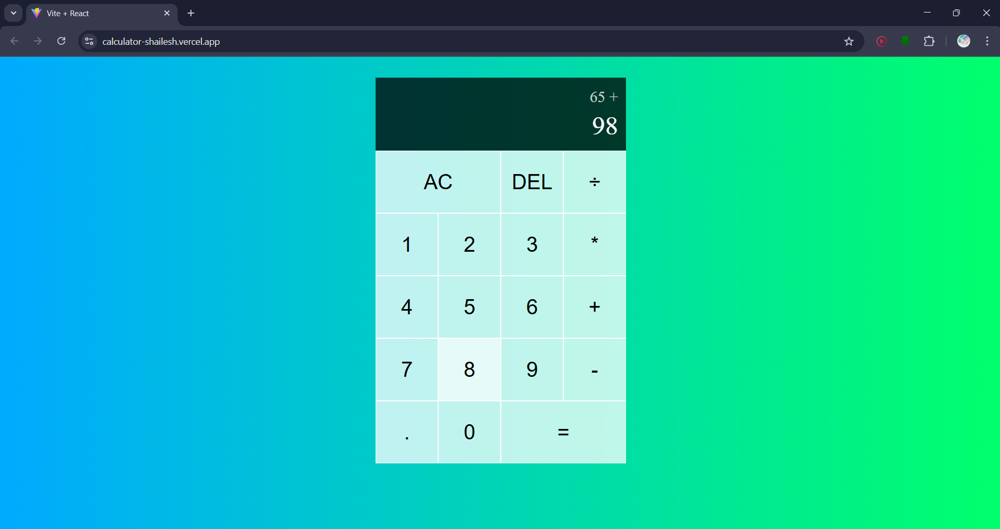

# React Calculator App

[](LICENSE)

A simple yet functional calculator built with **React** and the `useReducer` hook. This project demonstrates core React concepts including component reusability, state management with reducers, and clean UI structure using CSS.



---

## 🚀 Features

- Basic arithmetic operations: addition, subtraction, multiplication, division
- Decimal support
- Delete single digit (`DEL`)
- Clear all inputs (`AC`)
- Prevents multiple `.` or leading zeros
- Displays formatted numbers for better readability

---

## 📁 Project Structure

```
calculator/
├── public/
├── src/
│   ├── App.js
│   ├── DigitButton.js
│   ├── index.css
│   ├── main.js
│   ├── OperationButton.js
│   └── styles.css
├── index.html
├── package.json
├── README.md
├── screenshot.png       👈 (make sure it’s renamed like this)
```

---

## 🛠️ Technologies Used

- React (with functional components)
- JavaScript (ES6+)
- useReducer for state management
- CSS for styling

---

## 🧠 Key Concepts Used

- **useReducer** for managing calculator state (digits, operations, evaluations)
- **Component reuse** with `DigitButton` and `OperationButton`
- **Intl.NumberFormat** for formatting integers
- **Controlled rendering** based on operand and operation state

---

## 📦 Installation & Setup

```bash
# Clone the repo
git clone https://github.com/your-username/react-calculator.git

# Navigate to the project directory
cd react-calculator

# Install dependencies
npm install

# Start the development server
npm start
```

---

Open http://localhost:3000 to view it in the browser.

## 🖼️ Screenshot

Make sure `screenshot.png` is in the project root (as shown above).

---

## 🧑‍💻 Author

**Shailesh Adole**  
GitHub: [shaileshadole](https://github.com/shaileshadole)

---

## 🚀 Let's Connect

- 🌐 [LinkedIn](https://www.linkedin.com/in/shailesh-adole-01306a303/)
- ✉️ Email: adoleshailesh2@gmail.com

---

## 📄 License

This project is licensed under the [MIT License](LICENSE).
